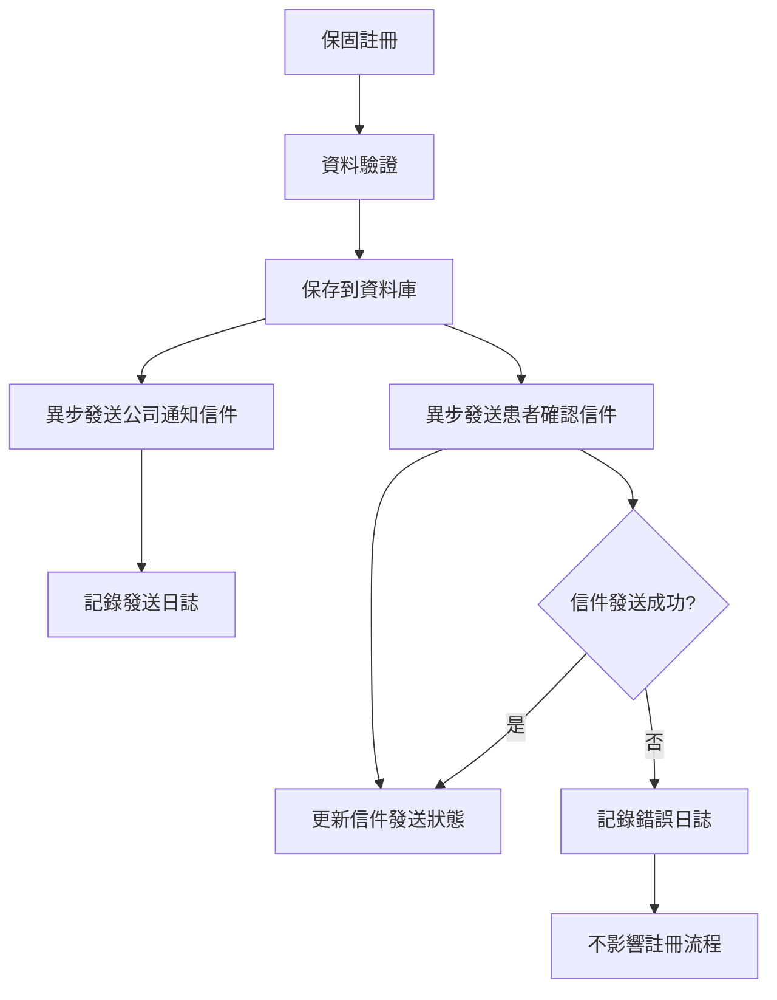

# 乳房植入物保固系統 - 前端開發 API 文檔

## 📋 項目概述

### 項目目的

本系統是為**偉鉅股份有限公司**開發的乳房植入物保固管理系統，主要功能包括：

1. **保固註冊**：患者或醫院可以註冊乳房植入物保固，支援雙序號功能
2. **保固查詢**：管理員可以搜尋和管理保固記錄，支援雙序號搜尋
3. **產品管理**：管理乳房植入物產品資訊
4. **用戶管理**：系統用戶的權限管理
5. **統計報表**：保固統計和數據分析
6. **審計日誌**：系統操作記錄追蹤

### 🆕 雙序號功能特色

本系統支援**雙序號功能**，專為雙側乳房植入手術設計：

- **單側手術**：只需填寫一個植入體序號
- **雙側手術**：可以填寫兩個不同的植入體序號（如左側、右側）
- **智能搜尋**：可以通過任一序號搜尋到對應的保固記錄
- **完整驗證**：確保序號不重複、格式正確

### 🆕 終身保固功能特色

本系統支援**終身保固功能**，適用於特殊產品：

- **終身保固產品**：`warranty_years = 0` 表示終身保固
- **保固期限**：終身保固產品的保固結束日期設為 `9999-12-31T23:59:59Z`
- **統計排除**：終身保固產品不會出現在「即將到期」統計中
- **清楚標示**：前端可以根據 `warranty_years` 值判斷並顯示「終身保固」

### 🆕 終身保固功能特色

本系統支援**終身保固功能**，適用於特殊產品：

- **終身保固產品**：`warranty_years = 0` 表示終身保固
- **保固期限**：終身保固產品的保固結束日期設為 `9999-12-31`
- **統計排除**：終身保固產品不會出現在「即將到期」統計中
- **清楚標示**：前端可以根據 `warranty_years` 值判斷並顯示「終身保固」

### 技術架構

- **後端**：Go + Echo 框架 + PostgreSQL
- **認證**：JWT Token
- **加密**：AES-256-GCM（身分證字號、手機號碼）
- **API 版本**：v1
- **基礎 URL**：`http://localhost:8080/api/v1`

### 用戶角色

- **admin**：系統管理員，擁有所有權限
- **editor**：編輯者，可以管理保固和產品
- **readonly**：只讀用戶，僅能查看數據

## 🔐 認證系統

### 1. 登入 API

**端點**：`POST /api/v1/auth/login`  
**權限**：公開  
**描述**：用戶登入系統

**請求參數**：

```json
{
  "username": "admin",
  "password": "admin123"
}
```

**回應格式**：

```json
{
  "token": "eyJhbGciOiJIUzI1NiIsInR5cCI6IkpXVCJ9...",
  "expires_at": "2024-12-22T10:30:00Z",
  "user": {
    "id": "e11f217a-8aad-40bc-b5e1-fdbe0679e857",
    "username": "admin",
    "email": "admin@example.com",
    "role": "admin",
    "is_active": true,
    "last_login_at": "2024-12-21T10:30:00Z",
    "created_at": "2024-01-01T00:00:00Z",
    "updated_at": "2024-12-21T10:30:00Z"
  }
}
```

**錯誤回應**：

```json
{
  "error": "Invalid username or password"
}
```

### 2. 認證頭部

所有需要認證的 API 請求都需要在 Header 中包含：

```
Authorization: Bearer <token>
```

## 📦 產品管理 API

### 1. 取得產品列表（公開）

**端點**：`GET /api/v1/products`  
**權限**：公開  
**描述**：取得活躍產品列表，供保固註冊使用

**查詢參數**：

- `page`：頁碼（默認：1）
- `page_size`：每頁數量（默認：20）
- `active`：產品狀態篩選
  - 不傳參數：顯示所有產品（啟用+停用）
  - `active=true`：只顯示啟用的產品
  - `active=false`：只顯示停用的產品

**回應格式**：

```json
{
  "products": [
    {
      "id": "0fcfbcf6-78ed-4a66-a531-d26fdea77113",
      "model_number": "MENTOR-CPG321",
      "brand": "Mentor",
      "type": "圓形矽膠",
      "size": "321cc",
      "warranty_years": 10,
      "description": "Mentor MemoryGel 圓形矽膠義乳 321cc",
      "is_active": true,
      "created_at": "2024-01-01T00:00:00Z",
      "updated_at": "2024-01-01T00:00:00Z"
    }
  ],
  "total": 12,
  "page": 1,
  "page_size": 20,
  "total_pages": 1
}
```

### 2. 建立產品（需認證）

**端點**：`POST /api/v1/products`  
**權限**：admin, editor  
**描述**：建立新產品

**請求參數**：

```json
{
  "model_number": "MENTOR-CPG421",
  "brand": "Mentor",
  "type": "圓形矽膠",
  "size": "421cc",
  "warranty_years": 10,
  "description": "Mentor MemoryGel 圓形矽膠義乳 421cc"
}
```

**回應格式**：

```json
{
  "id": "c0ebb1df-f737-4dc4-a23f-666333d3ecc1",
  "model_number": "MENTOR-CPG421",
  "brand": "Mentor",
  "type": "圓形矽膠",
  "size": "421cc",
  "warranty_years": 10,
  "description": "Mentor MemoryGel 圓形矽膠義乳 421cc",
  "is_active": true,
  "created_at": "2024-12-21T10:30:00Z",
  "updated_at": "2024-12-21T10:30:00Z"
}
```

### 3. 取得單個產品（需認證）

**端點**：`GET /api/v1/products/{id}`  
**權限**：admin, editor, readonly  
**描述**：根據 ID 取得產品詳情

### 4. 更新產品（需認證）

**端點**：`PUT /api/v1/products/{id}`  
**權限**：admin, editor  
**描述**：更新產品資訊

### 5. 刪除產品（需認證）

**端點**：`DELETE /api/v1/products/{id}`  
**權限**：admin  
**描述**：刪除產品

## 🛡️ 保固管理 API

### 1. 檢查產品序號（公開）🆕

**端點**：`GET /api/v1/warranty/check-serial`
**權限**：公開
**描述**：檢查產品序號是否已被註冊，用於防止重複註冊

**查詢參數**：

- `serial_number` (必需): 要檢查的產品序號

**回應格式**：

**序號可用時**：

```json
{
  "exists": false,
  "message": "Serial number is available"
}
```

**序號已被註冊時**：

```json
{
  "exists": true,
  "message": "Serial number is already registered"
}
```

**參數錯誤時** (HTTP 400)：

```json
{
  "error": "serial_number parameter is required"
}
```

**使用場景**：

- 保固註冊表單的即時驗證
- 防止重複註冊同一產品序號
- 提升用戶體驗，提前告知序號狀態

**安全設計**：

- 此端點為公開訪問，但不會返回任何敏感的保固資訊
- 僅返回序號是否存在的狀態，保護用戶隱私

**前端實作範例**：

```javascript
// 檢查序號可用性
async function checkSerialNumber(serialNumber) {
  if (!serialNumber) return true;

  try {
    const response = await fetch(
      `/api/v1/warranty/check-serial?serial_number=${encodeURIComponent(
        serialNumber
      )}`
    );
    const data = await response.json();

    if (response.ok) {
      return !data.exists; // 不存在表示可用
    } else {
      console.error("檢查序號時發生錯誤:", data.error);
      return false;
    }
  } catch (error) {
    console.error("網路錯誤:", error);
    return false;
  }
}

// 在表單中使用
document.getElementById("serialNumber").addEventListener("blur", async (e) => {
  const serialNumber = e.target.value.trim();
  const errorElement = document.getElementById("serialNumberError");

  if (serialNumber) {
    const isAvailable = await checkSerialNumber(serialNumber);
    if (!isAvailable) {
      errorElement.textContent = "此序號已被註冊，請檢查輸入或聯繫客服";
      errorElement.style.display = "block";
    } else {
      errorElement.style.display = "none";
    }
  }
});
```

**注意事項**：

- 建議實現防抖（debounce）機制，避免頻繁調用 API
- 適當處理網路錯誤和 API 錯誤回應
- 可以結合第二個序號一起檢查（雙側手術情況）

### 2. 批次創建空白保固（管理員專用）🆕

**端點**：`POST /api/v1/warranty/batch-create`
**權限**：需要認證（管理員或編輯者）
**描述**：批次創建空白保固記錄，用於後續患者填寫

**請求參數**：

```json
{
  "count": 10
}
```

**參數說明**：

- `count` (必需): 要創建的空白保固數量，範圍 1-100

**回應格式**：

```json
{
  "count": 10,
  "ids": [
    "550e8400-e29b-41d4-a716-446655440001",
    "550e8400-e29b-41d4-a716-446655440002",
    "..."
  ]
}
```

**使用場景**：

- 管理員預先創建空白保固記錄
- 獲得 UUID 陣列用於生成患者填寫網址
- 支援批次作業，提高效率

**前端實作範例**：

```javascript
async function batchCreateWarranties(count) {
  const response = await fetch("/api/v1/warranty/batch-create", {
    method: "POST",
    headers: {
      "Content-Type": "application/json",
      Authorization: `Bearer ${token}`,
    },
    body: JSON.stringify({ count }),
  });

  if (response.ok) {
    const data = await response.json();
    console.log(`創建了 ${data.count} 個空白保固記錄`);

    // 生成患者填寫網址
    const urls = data.ids.map(
      (id) => `https://warranty.gmmed.com.tw?action=register&id=${id}`
    );

    return urls;
  }
}
```

### 3. 檢查保固填寫狀態（公開）🆕

**端點**：`GET /api/v1/warranty/{id}/status`
**權限**：公開
**描述**：檢查保固是否已被填寫，用於判斷是否可以編輯

**路徑參數**：

- `id` (必需): 保固記錄的 UUID

**回應格式**：

**可以填寫時**：

```json
{
  "can_edit": true,
  "message": "Warranty can be filled"
}
```

**已被填寫時**：

```json
{
  "can_edit": false,
  "message": "Warranty has already been filled"
}
```

**保固不存在時** (HTTP 404)：

```json
{
  "error": "warranty not found"
}
```

**使用場景**：

- 患者訪問填寫頁面前檢查狀態
- 防止重複填寫已完成的保固
- 提供友好的用戶體驗

### 4. 患者填寫保固（公開，一次性）🆕

**端點**：`PUT /api/v1/warranty/{id}/register`
**權限**：公開（無需認證）
**描述**：患者通過唯一網址填寫保固資料，每個 UUID 只能填寫一次

**路徑參數**：

- `id` (必需): 保固記錄的 UUID

**請求參數**：

```json
{
  "patient_name": "王小明",
  "patient_id": "A123456789",
  "patient_birth_date": "1990-01-01T00:00:00Z",
  "patient_phone": "0912-345678",
  "patient_email": "patient@example.com",
  "hospital_name": "台大醫院",
  "doctor_name": "張醫師",
  "surgery_date": "2024-06-01T00:00:00Z",
  "product_id": "550e8400-e29b-41d4-a716-446655440000",
  "product_serial_number": "ABC123456",
  "product_serial_number_2": "ABC123457"
}
```

**參數說明**：

- `patient_name` (必需): 患者姓名
- `patient_id` (必需): 身分證字號（10 碼）
- `patient_birth_date` (必需): 出生日期
- `patient_phone` (必需): 手機號碼
- `patient_email` (必需): 電子郵件
- `hospital_name` (必需): 醫院名稱
- `doctor_name` (必需): 醫師姓名
- `surgery_date` (必需): 手術日期
- `product_id` (必需): 產品 UUID
- `product_serial_number` (必需): 產品序號
- `product_serial_number_2` (可選): 第二個產品序號（雙側手術）

**回應格式**：

```json
{
  "id": "550e8400-e29b-41d4-a716-446655440001",
  "patient_name": "王小明",
  "patient_id": "A123456789",
  "patient_phone": "0912-345678",
  "patient_email": "patient@example.com",
  "hospital_name": "台大醫院",
  "doctor_name": "張醫師",
  "surgery_date": "2024-06-01T00:00:00Z",
  "product_serial_number": "ABC123456",
  "product_serial_number_2": "ABC123457",
  "warranty_start_date": "2024-06-01T00:00:00Z",
  "warranty_end_date": "2029-06-01T00:00:00Z",
  "status": "active",
  "created_at": "2024-06-26T10:00:00Z",
  "updated_at": "2024-06-26T10:30:00Z"
}
```

**錯誤回應**：

**保固已被填寫** (HTTP 409)：

```json
{
  "error": "warranty has already been filled"
}
```

**保固不存在** (HTTP 404)：

```json
{
  "error": "warranty not found"
}
```

**序號已被註冊** (HTTP 409)：

```json
{
  "error": "product serial number already registered"
}
```

**兩個序號相同** (HTTP 400)：

```json
{
  "error": "two serial numbers cannot be the same"
}
```

**使用場景**：

- 患者通過管理方提供的唯一網址填寫保固
- 一次性填寫，防止重複修改
- 自動計算保固期間和發送確認信件

**前端實作範例**：

```javascript
async function fillWarranty(warrantyId, formData) {
  // 先檢查狀態
  const statusResponse = await fetch(`/api/v1/warranty/${warrantyId}/status`);
  const statusData = await statusResponse.json();

  if (!statusData.can_edit) {
    alert("此保固已被填寫，無法重複填寫");
    return;
  }

  // 填寫保固
  const response = await fetch(`/api/v1/warranty/${warrantyId}/register`, {
    method: "PUT",
    headers: {
      "Content-Type": "application/json",
    },
    body: JSON.stringify(formData),
  });

  if (response.ok) {
    const warranty = await response.json();
    alert("保固註冊成功！確認信件已發送至您的電子郵件。");
    return warranty;
  } else {
    const error = await response.json();
    alert(`註冊失敗：${error.error}`);
  }
}
```

### 5. 保固註冊（已棄用）⚠️

**端點**：`POST /api/v1/warranty/register`
**狀態**：已移除
**說明**：此端點已被新的保固流程取代，請使用批次創建 + 患者填寫的方式

**雙序號支援**：

- `product_serial_number`：第一個植入體序號（必填）
- `product_serial_number_2`：第二個植入體序號（選填，用於雙側植入手術）
- 兩個序號不能相同
- 兩個序號都不能與現有記錄重複
- 搜尋功能會同時搜尋兩個序號欄位
- 適用於單側手術（只填第一個序號）或雙側手術（填兩個序號）記錄

**請求參數**：

**雙側手術範例（兩個序號）**：

```json
{
  "product_id": "0fcfbcf6-78ed-4a66-a531-d26fdea77113",
  "product_serial_number": "LEFT-IMPLANT-001",
  "product_serial_number_2": "RIGHT-IMPLANT-002",
  "patient_name": "王小明",
  "patient_id": "A123456789",
  "patient_birth_date": "1990-01-01T00:00:00Z",
  "patient_phone": "0912345678",
  "patient_email": "patient@example.com",
  "hospital_name": "台大醫院",
  "doctor_name": "張醫師",
  "surgery_date": "2024-12-01T00:00:00Z"
}
```

**單側手術範例（一個序號）**：

```json
{
  "product_id": "0fcfbcf6-78ed-4a66-a531-d26fdea77113",
  "product_serial_number": "SINGLE-IMPLANT-001",
  "patient_name": "李小華",
  "patient_id": "B123456789",
  "patient_birth_date": "1985-05-15T00:00:00Z",
  "patient_phone": "0987654321",
  "patient_email": "patient2@example.com",
  "hospital_name": "台大醫院",
  "doctor_name": "張醫師",
  "surgery_date": "2024-12-01T00:00:00Z"
}
```

**終身保固產品範例**：

```json
{
  "product_id": "7257a877-0c49-43f8-ad50-58647303d28b",
  "product_serial_number": "LIFETIME-TEST-001",
  "patient_name": "終身保固測試患者",
  "patient_id": "A123456789",
  "patient_birth_date": "1980-01-01T00:00:00Z",
  "patient_phone": "0912345678",
  "patient_email": "lifetime-test@example.com",
  "hospital_name": "終身保固測試醫院",
  "doctor_name": "終身保固醫師",
  "surgery_date": "2025-06-22T00:00:00Z"
}
```

**回應格式**：

**雙側手術回應範例**：

```json
{
  "id": "cc93a3e5-83e2-4b4f-89bf-2157c46a92b7",
  "patient_name": "王小明",
  "patient_birth_date": "1990-01-01T00:00:00Z",
  "patient_email": "patient@example.com",
  "hospital_name": "台大醫院",
  "doctor_name": "張醫師",
  "surgery_date": "2024-12-01T00:00:00Z",
  "product_id": "0fcfbcf6-78ed-4a66-a531-d26fdea77113",
  "product_serial_number": "LEFT-IMPLANT-001",
  "product_serial_number_2": "RIGHT-IMPLANT-002",
  "warranty_start_date": "2024-12-01T00:00:00Z",
  "warranty_end_date": "2034-12-01T00:00:00Z",
  "status": "active",
  "created_at": "2024-12-21T10:30:00Z",
  "updated_at": "2024-12-21T10:30:00Z",
  "product": {
    "id": "0fcfbcf6-78ed-4a66-a531-d26fdea77113",
    "model_number": "MENTOR-CPG321",
    "brand": "Mentor",
    "type": "圓形矽膠",
    "size": "321cc",
    "warranty_years": 10
  }
}
```

**單側手術回應範例**：

```json
{
  "id": "d1fcc2ef-g848-5dc5-b34g-777444e4fdd2",
  "patient_name": "李小華",
  "patient_birth_date": "1985-05-15T00:00:00Z",
  "patient_email": "patient2@example.com",
  "hospital_name": "台大醫院",
  "doctor_name": "張醫師",
  "surgery_date": "2024-12-01T00:00:00Z",
  "product_id": "0fcfbcf6-78ed-4a66-a531-d26fdea77113",
  "product_serial_number": "SINGLE-IMPLANT-001",
  "product_serial_number_2": null,
  "warranty_start_date": "2024-12-01T00:00:00Z",
  "warranty_end_date": "2034-12-01T00:00:00Z",
  "status": "active",
  "created_at": "2024-12-21T10:30:00Z",
  "updated_at": "2024-12-21T10:30:00Z",
  "product": {
    "id": "0fcfbcf6-78ed-4a66-a531-d26fdea77113",
    "model_number": "MENTOR-CPG421",
    "brand": "Mentor",
    "type": "圓形矽膠",
    "size": "421cc",
    "warranty_years": 10
  }
}
```

**終身保固回應範例**：

```json
{
  "id": "a2aeda2c-0888-4640-b976-1f72cc4f5c91",
  "patient_name": "終身保固測試患者",
  "patient_birth_date": "1980-01-01T00:00:00Z",
  "patient_email": "lifetime-test@example.com",
  "hospital_name": "終身保固測試醫院",
  "doctor_name": "終身保固醫師",
  "surgery_date": "2025-06-22T00:00:00Z",
  "product_id": "7257a877-0c49-43f8-ad50-58647303d28b",
  "product_serial_number": "LIFETIME-TEST-001",
  "product_serial_number_2": null,
  "warranty_start_date": "2025-06-22T00:00:00Z",
  "warranty_end_date": "9999-12-31T23:59:59Z",
  "status": "active",
  "created_at": "2025-06-22T21:32:40.454704+08:00",
  "updated_at": "2025-06-22T21:32:40.454704+08:00",
  "product": {
    "id": "7257a877-0c49-43f8-ad50-58647303d28b",
    "model_number": "LIFETIME-001",
    "brand": "Premium Brand",
    "type": "終身保固型",
    "size": "400cc",
    "warranty_years": 0,
    "description": "終身保固產品",
    "is_active": true,
    "created_at": "2025-06-22T13:31:28.559122Z",
    "updated_at": "2025-06-22T13:31:28.559122Z"
  }
}
```

**錯誤回應範例**：

**重複序號錯誤**：

```json
{
  "error": "product serial number already registered"
}
```

**第二個序號重複錯誤**：

```json
{
  "error": "second product serial number already registered"
}
```

**相同序號錯誤**：

```json
{
  "error": "two serial numbers cannot be the same"
}
```

**序號格式錯誤**：

```json
{
  "error": "product serial number must be between 6 and 50 characters"
}
```

**第二個序號格式錯誤**：

```json
{
  "error": "second product serial number must be between 6 and 50 characters"
}
```

### 2. 保固搜尋（需認證）

**端點**：`GET /api/v1/warranty/search`
**權限**：admin, editor, readonly
**描述**：搜尋保固記錄，支援多種搜尋條件，包括雙序號搜尋

**查詢參數**：

- `q`：通用搜尋（患者姓名、身分證字號、產品序號）
- `patient_name`：患者姓名
- `serial_number`：產品序號（會同時搜尋第一個和第二個序號）
- `hospital_name`：醫院名稱
- `doctor_name`：醫師姓名
- `status`：保固狀態（active/expired/cancelled）
- `start_date`：開始日期（YYYY-MM-DD）
- `end_date`：結束日期（YYYY-MM-DD）
- `page`：頁碼（默認：1）
- `page_size`：每頁數量（默認：20）

**雙序號搜尋說明**：

- 使用 `serial_number` 參數可以搜尋第一個序號或第二個序號
- 例如：`/api/v1/warranty/search?serial_number=LEFT-IMPLANT-001` 會找到第一個序號為 `LEFT-IMPLANT-001` 的記錄
- 例如：`/api/v1/warranty/search?serial_number=RIGHT-IMPLANT-002` 會找到第二個序號為 `RIGHT-IMPLANT-002` 的記錄

**回應格式**：

```json
{
  "warranties": [
    {
      "id": "cc93a3e5-83e2-4b4f-89bf-2157c46a92b7",
      "patient_name": "王小明",
      "patient_birth_date": "1990-01-01T00:00:00Z",
      "patient_email": "patient@example.com",
      "hospital_name": "台大醫院",
      "doctor_name": "張醫師",
      "surgery_date": "2024-12-01T00:00:00Z",
      "product_id": "0fcfbcf6-78ed-4a66-a531-d26fdea77113",
      "product_serial_number": "LEFT-IMPLANT-001",
      "product_serial_number_2": "RIGHT-IMPLANT-002",
      "warranty_start_date": "2024-12-01T00:00:00Z",
      "warranty_end_date": "2034-12-01T00:00:00Z",
      "status": "active",
      "created_at": "2024-12-21T10:30:00Z",
      "updated_at": "2024-12-21T10:30:00Z",
      "product": {
        "id": "0fcfbcf6-78ed-4a66-a531-d26fdea77113",
        "model_number": "MENTOR-CPG321",
        "brand": "Mentor",
        "type": "圓形矽膠",
        "size": "321cc",
        "warranty_years": 10
      }
    }
  ],
  "total": 18,
  "page": 1,
  "page_size": 20,
  "total_pages": 1
}
```

### 3. 保固統計（需認證）

**端點**：`GET /api/v1/warranty/statistics`  
**權限**：admin, editor, readonly  
**描述**：取得保固統計數據

**回應格式**：

```json
{
  "total_registrations": 150,
  "active_warranties": 120,
  "expired_warranties": 25,
  "expiring_soon": 5,
  "hospital_stats": [
    {
      "hospital_name": "台大醫院",
      "total_registrations": 45,
      "active_registrations": 40,
      "total_doctors": 8
    }
  ],
  "product_stats": [
    {
      "product_id": "0fcfbcf6-78ed-4a66-a531-d26fdea77113",
      "model_number": "MENTOR-CPG321",
      "brand": "Mentor",
      "total_usage": 30,
      "active_usage": 25
    }
  ],
  "monthly_registrations": [
    {
      "year": 2024,
      "month": 12,
      "count": 15
    }
  ]
}
```

### 4. 保固列表（需認證）

**端點**：`GET /api/v1/warranty`
**權限**：admin, editor, readonly
**描述**：取得保固記錄列表

**查詢參數**：

- `page`：頁碼（默認：1）
- `page_size`：每頁數量（默認：20）

**回應格式**：

```json
{
  "message": "Warranty list endpoint"
}
```

### 5. 取得單個保固記錄（需認證）

**端點**：`GET /api/v1/warranty/{id}`
**權限**：admin, editor, readonly
**描述**：根據 ID 取得保固記錄詳情

**回應格式**（終身保固範例）：

```json
{
  "id": "a2aeda2c-0888-4640-b976-1f72cc4f5c91",
  "patient_name": "終身保固測試患者",
  "patient_id": "A123456789",
  "patient_birth_date": "1980-01-01T00:00:00Z",
  "patient_phone": "0912345678",
  "patient_email": "lifetime-test@example.com",
  "hospital_name": "終身保固測試醫院",
  "doctor_name": "終身保固醫師",
  "surgery_date": "2025-06-22T00:00:00Z",
  "product_id": "7257a877-0c49-43f8-ad50-58647303d28b",
  "product_serial_number": "LIFETIME-TEST-001",
  "product_serial_number_2": null,
  "warranty_start_date": "2025-06-22T00:00:00Z",
  "warranty_end_date": "9999-12-31T00:00:00Z",
  "confirmation_email_sent": false,
  "email_sent_at": null,
  "status": "active",
  "created_at": "2025-06-22T21:32:40.454704+08:00",
  "updated_at": "2025-06-22T21:32:40.454704+08:00",
  "product": {
    "id": "7257a877-0c49-43f8-ad50-58647303d28b",
    "model_number": "LIFETIME-001",
    "brand": "Premium Brand",
    "type": "終身保固型",
    "size": "400cc",
    "warranty_years": 0,
    "description": "終身保固產品",
    "is_active": true,
    "created_at": "2025-06-22T13:31:28.559122Z",
    "updated_at": "2025-06-22T13:31:28.559122Z"
  }
}
```

**錯誤回應**：

```json
{
  "error": "warranty registration not found"
}
```

### 6. 更新保固記錄（需認證）

**端點**：`PUT /api/v1/warranty/{id}`
**權限**：admin, editor
**描述**：更新保固記錄資訊

**請求參數**：

```json
{
  "patient_name": "王小明",
  "patient_id": "A123456789",
  "patient_birth_date": "1990-01-01T00:00:00Z",
  "patient_phone": "0912345678",
  "patient_email": "patient@example.com",
  "hospital_name": "台大醫院",
  "doctor_name": "張醫師",
  "surgery_date": "2024-12-01T00:00:00Z",
  "status": "active"
}
```

**回應格式**：與取得單個保固記錄相同

### 7. 刪除保固記錄（需認證）

**端點**：`DELETE /api/v1/warranty/{id}`
**權限**：admin
**描述**：刪除保固記錄

**回應格式**：

```json
{
  "message": "Warranty delete endpoint"
}
```

### 8. 重新發送確認信件（需認證）

**端點**：`POST /api/v1/warranty/{id}/resend-email`
**權限**：admin, editor
**描述**：重新發送保固確認信件給患者

**回應格式**：

```json
{
  "message": "Warranty resend email endpoint"
}
```

### 9. 匯出 Excel（需認證）

**端點**：`GET /api/v1/warranty/export`
**權限**：admin, editor, readonly
**描述**：匯出保固記錄為 Excel 文件

**查詢參數**：

- 支援與搜尋 API 相同的篩選參數
- `format`：匯出格式（默認：excel）

**回應格式**：

- Content-Type: `application/vnd.openxmlformats-officedocument.spreadsheetml.sheet`
- 文件下載

**目前狀態**：

```json
{
  "message": "Excel export functionality - currently returning JSON data",
  "data": {...},
  "total": 25
}
```

### 10. 批次更新過期狀態（需認證）

**端點**：`POST /api/v1/warranty/update-expired`
**權限**：admin
**描述**：批次更新所有過期保固的狀態為 `expired`

**回應格式**：

```json
{
  "message": "expired warranties updated successfully",
  "updated_count": 2
}
```

**使用場景**：

- 定期維護任務
- 手動觸發狀態同步
- 系統管理功能

## 👥 用戶管理 API

### 1. 用戶列表（需認證）

**端點**：`GET /api/v1/users`  
**權限**：admin  
**描述**：取得系統用戶列表

**查詢參數**：

- `page`：頁碼（默認：1）
- `page_size`：每頁數量（默認：20）

**回應格式**：

```json
{
  "users": [
    {
      "id": "e11f217a-8aad-40bc-b5e1-fdbe0679e857",
      "username": "admin",
      "email": "admin@example.com",
      "role": "admin",
      "is_active": true,
      "last_login_at": "2024-12-21T10:30:00Z",
      "created_at": "2024-01-01T00:00:00Z",
      "updated_at": "2024-12-21T10:30:00Z"
    }
  ],
  "total": 2,
  "page": 1,
  "page_size": 20,
  "total_pages": 1
}
```

### 2. 建立用戶（需認證）

**端點**：`POST /api/v1/users`  
**權限**：admin  
**描述**：建立新用戶

**請求參數**：

```json
{
  "username": "newuser",
  "email": "newuser@example.com",
  "password": "password123",
  "role": "editor"
}
```

### 3. 更新用戶（需認證）

**端點**：`PUT /api/v1/users/{id}`  
**權限**：admin  
**描述**：更新用戶資訊

### 4. 刪除用戶（需認證）

**端點**：`DELETE /api/v1/users/{id}`  
**權限**：admin  
**描述**：刪除用戶

## 📋 審計日誌 API

### 1. 審計日誌列表（需認證）

**端點**：`GET /api/v1/audit`
**權限**：admin
**描述**：取得系統操作審計日誌

**查詢參數**：

- `page`：頁碼（默認：1）
- `page_size`：每頁數量（默認：20，最大：100）
- `user_id`：用戶 ID 篩選
- `action`：操作類型篩選（LOGIN/CREATE/UPDATE/DELETE/VIEW/EXPORT/IMPORT）
- `table_name`：表名篩選（users/products/warranty_registrations/auth）
- `start_date`：開始日期（YYYY-MM-DD 格式）
- `end_date`：結束日期（YYYY-MM-DD 格式）
- `ip_address`：IP 地址篩選

**回應格式**：

```json
{
  "audit_logs": [
    {
      "id": "a0c6874b-4f1e-472b-ae83-966679389f6b",
      "user_id": "e11f217a-8aad-40bc-b5e1-fdbe0679e857",
      "action": "CREATE",
      "table_name": "products",
      "record_id": null,
      "old_values": {},
      "new_values": {},
      "ip_address": "127.0.0.1",
      "user_agent": "curl/8.7.1",
      "created_at": "2025-06-22T05:27:46.938606Z",
      "user": {
        "username": "admin",
        "email": "admin@example.com"
      }
    }
  ],
  "total": 1,
  "page": 1,
  "page_size": 20,
  "total_pages": 1
}
```

### 2. 取得單個審計日誌（需認證）

**端點**：`GET /api/v1/audit/{id}`
**權限**：admin
**描述**：根據 ID 取得審計日誌詳情

**回應格式**：

```json
{
  "id": "a0c6874b-4f1e-472b-ae83-966679389f6b",
  "user_id": "e11f217a-8aad-40bc-b5e1-fdbe0679e857",
  "action": "CREATE",
  "table_name": "products",
  "record_id": null,
  "old_values": {},
  "new_values": {},
  "ip_address": "127.0.0.1",
  "user_agent": "curl/8.7.1",
  "created_at": "2025-06-22T05:27:46.938606Z",
  "user": {
    "username": "admin",
    "email": "admin@example.com"
  }
}
```

**錯誤回應**：

```json
{
  "error": "Audit log not found"
}
```

### 3. 審計日誌自動記錄

系統會自動記錄以下操作：

- **登入操作**：用戶登入系統
- **用戶管理**：建立、更新、刪除用戶
- **產品管理**：建立、更新、刪除產品
- **保固管理**：建立、更新、刪除保固記錄

**記錄的資訊包括**：

- 操作用戶 ID 和用戶名
- 操作類型（CREATE/UPDATE/DELETE/LOGIN 等）
- 操作的表名
- 記錄 ID（如果適用）
- 操作前後的數據（old_values/new_values）
- 客戶端 IP 地址
- User Agent 資訊
- 操作時間

## 🏥 健康檢查

### 健康檢查

**端點**：`GET /health`  
**權限**：公開  
**描述**：檢查系統健康狀態

**回應格式**：

```json
{
  "status": "ok",
  "time": "2024-12-21T10:30:00Z"
}
```

## 🚨 錯誤處理

### HTTP 狀態碼

- `200`：成功
- `201`：建立成功
- `400`：請求參數錯誤
- `401`：未認證
- `403`：權限不足
- `404`：資源不存在
- `500`：伺服器內部錯誤

### 錯誤回應格式

```json
{
  "error": "錯誤描述資訊"
}
```

## 🔒 安全注意事項

1. **身分證字號和手機號碼**：在資料庫中以 AES-256-GCM 加密儲存
2. **JWT Token**：24 小時有效期
3. **CORS**：已設定允許的來源
4. **Rate Limiting**：每分鐘 100 次請求限制
5. **密碼**：使用 bcrypt 加密儲存

## 📱 前端實作建議

### 頁面結構建議

#### 🆕 新保固流程頁面

1. **管理員保固管理頁面**：

   - **批次創建功能**：使用批次創建 API，輸入數量獲得 UUID 陣列
   - **網址生成器**：自動生成患者填寫網址 `https://warranty.gmmed.com.tw?action=register&id={uuid}`
   - **狀態追蹤**：顯示哪些保固已被填寫，哪些還在等待
   - **保固列表**：只顯示已填寫的保固記錄（`created_at != updated_at`）

2. **患者保固填寫頁面**：
   - **狀態檢查**：頁面載入時先檢查保固狀態 API
   - **一次性填寫**：使用患者填寫保固 API，填寫後無法再修改
   - **即時驗證**：序號檢查、格式驗證、重複檢查
   - **成功提示**：填寫成功後顯示確認信息和信件發送提示

#### 傳統頁面

3. **登入頁面**：使用登入 API

4. **管理後台**：
   - **儀表板**：使用統計 API
   - **保固管理**：使用保固搜尋和列表 API，支援雙序號搜尋
   - **產品管理**：使用產品 CRUD API
   - **用戶管理**：使用用戶 CRUD API
   - **審計日誌**：使用審計日誌 API

### 狀態管理

- 使用 JWT Token 進行認證狀態管理
- 實現自動 token 刷新機制
- 根據用戶角色顯示不同功能

### 用戶體驗

- 實現 loading 狀態
- 錯誤處理和用戶提示
- 響應式設計支援移動設備
- 表單驗證和即時反應

### 雙序號功能前端實作建議

1. **保固註冊表單**：

   - 第一個序號欄位標記為必填
   - 第二個序號欄位標記為選填，並提供說明（如：「雙側手術請填寫第二個序號」）
   - 實現即時驗證，確保兩個序號不相同
   - 使用序號檢查 API 即時驗證序號是否已被註冊
   - 提供清楚的錯誤提示訊息

2. **搜尋功能**：

   - 序號搜尋欄位說明會同時搜尋兩個序號
   - 搜尋結果清楚顯示兩個序號（如果有的話）
   - 考慮在搜尋結果中標示哪個序號匹配了搜尋條件

3. **顯示格式**：
   - 單側手術：只顯示第一個序號
   - 雙側手術：顯示兩個序號，可以用「/」分隔或分行顯示
   - 例如：「LEFT-001 / RIGHT-002」或分別標示「左側：LEFT-001，右側：RIGHT-002」

### 終身保固功能前端實作建議

1. **保固期限顯示**：

   - 檢查 `product.warranty_years` 是否為 0
   - 如果為 0，顯示「終身保固」而不是具體的到期日期
   - 例如：`warranty_years === 0 ? "終身保固" : "保固至 " + warranty_end_date`

2. **產品選擇**：

   - 在產品列表中清楚標示終身保固產品
   - 可以使用特殊圖標或標籤來區分終身保固產品
   - 例如：「LIFETIME-001 (終身保固)」

3. **統計和報表**：

   - 終身保固產品不會出現在「即將到期」列表中
   - 在統計圖表中可以單獨分類顯示終身保固產品
   - 提供終身保固產品的專門統計視圖

4. **搜尋和篩選**：
   - 提供按保固類型篩選的選項（一般保固/終身保固）
   - 在搜尋結果中清楚標示終身保固記錄

---

## 📋 API 端點總覽

### 保固管理 API

| 方法   | 端點                                 | 權限 | 描述                   | 狀態        |
| ------ | ------------------------------------ | ---- | ---------------------- | ----------- |
| GET    | `/api/v1/warranty/check-serial`      | 公開 | 檢查產品序號           | ✅ 完整實現 |
| GET    | `/api/v1/warranty/{id}/status`       | 公開 | 檢查保固填寫狀態       | ✅ 完整實現 |
| PUT    | `/api/v1/warranty/{id}/register`     | 公開 | 患者填寫保固（一次性） | ✅ 完整實現 |
| POST   | `/api/v1/warranty/batch-create`      | 認證 | 批次創建空白保固       | ✅ 完整實現 |
| GET    | `/api/v1/warranty/search`            | 認證 | 保固搜尋               | ✅ 完整實現 |
| GET    | `/api/v1/warranty/statistics`        | 認證 | 保固統計               | ✅ 完整實現 |
| GET    | `/api/v1/warranty`                   | 認證 | 保固列表               | ✅ 完整實現 |
| GET    | `/api/v1/warranty/{id}`              | 認證 | 取得單個保固           | ✅ 完整實現 |
| PUT    | `/api/v1/warranty/{id}`              | 認證 | 更新保固               | ✅ 完整實現 |
| DELETE | `/api/v1/warranty/{id}`              | 認證 | 刪除保固               | ✅ 完整實現 |
| POST   | `/api/v1/warranty/{id}/resend-email` | 認證 | 重發信件               | ✅ 完整實現 |
| GET    | `/api/v1/warranty/export`            | 認證 | 匯出 Excel             | 🚧 基礎端點 |
| POST   | `/api/v1/warranty/update-expired`    | 認證 | 批次更新過期狀態       | ✅ 完整實現 |

### 特色功能

- ✅ **新保固流程**：管理方批次創建空白保固，患者通過唯一網址一次性填寫
- ✅ **序號檢查**：公開端點檢查產品序號是否已被註冊，防止重複註冊
- ✅ **保固狀態檢查**：檢查保固是否已被填寫，支援一次性填寫限制
- ✅ **批次創建**：管理員可批次創建空白保固記錄，獲得 UUID 陣列
- ✅ **一次性填寫**：每個保固 UUID 只能被填寫一次，防止重複修改
- ✅ **雙序號支援**：支援單側和雙側手術的序號管理
- ✅ **終身保固**：支援 `warranty_years = 0` 的終身保固產品
- ✅ **智能搜尋**：可通過任一序號搜尋保固記錄，只顯示已填寫記錄
- ✅ **統計排除**：終身保固不計入即將到期統計
- ✅ **資料解密**：API 回應包含解密後的身分證字號和手機號碼
- ✅ **完整 CRUD**：支援保固記錄的完整增刪改查操作
- ✅ **自動狀態更新**：系統自動檢測並更新過期保固狀態
- ✅ **批次狀態更新**：提供管理端點批次更新過期狀態
- ✅ **信件通知系統**：使用 Mailgun 自動發送保固確認信件

### 圖例

- ✅ **完整實現**：功能完整，包含完整的業務邏輯
- 🚧 **基礎端點**：端點存在但返回基礎訊息，需要進一步實現

### 🔒 資料安全說明

#### 敏感資料處理

- **身分證字號**和**手機號碼**在資料庫中使用 AES-256-GCM 加密儲存
- API 回應中會自動解密這些敏感資料，前端可直接使用
- 加密/解密過程對前端完全透明

#### 回應格式變更

所有保固相關的 API 回應現在都包含解密後的敏感資料：

```json
{
  "patient_id": "A123456789", // 解密後的身分證字號
  "patient_phone": "0912345678" // 解密後的手機號碼
}
```

#### 權限控制

- 所有包含敏感資料的 API 都需要認證
- 只有具備適當權限的用戶才能訪問完整的保固資料

### 🔄 保固狀態自動管理

#### 狀態類型

- **`active`**：有效的保固（未過期）
- **`expired`**：已過期的保固
- **`cancelled`**：已取消的保固

#### 自動狀態更新機制

1. **即時更新**：當取得保固記錄時，系統會自動檢查是否過期並更新狀態
2. **批次更新**：管理員可以使用 `POST /api/v1/warranty/update-expired` 批次更新所有過期記錄
3. **終身保固保護**：`warranty_years = 0` 的產品永不會被標記為過期

#### 過期判斷邏輯

```javascript
// 前端判斷邏輯參考
function isWarrantyExpired(warranty) {
  // 終身保固永不過期
  if (warranty.product.warranty_years === 0) {
    return false;
  }

  // 檢查保固結束日期
  return new Date() > new Date(warranty.warranty_end_date);
}

function getWarrantyStatus(warranty) {
  if (warranty.status === "cancelled") {
    return "cancelled";
  }

  return isWarrantyExpired(warranty) ? "expired" : "active";
}
```

#### 統計影響

- 過期保固會正確計入 `expired_warranties` 統計
- 終身保固不會出現在 `expiring_soon` 統計中
- 狀態更新會即時反映在統計數據中

### 📧 信件通知系統

#### 信件服務特色

系統使用 **Mailgun 官方 SDK** 實現信件發送功能：

- ✅ HTML 和純文字格式信件
- ✅ 自動信件追蹤和標籤
- ✅ 異步發送（不影響主要業務流程）
- ✅ 智能錯誤處理和重試機制
- ✅ 支援終身保固和雙序號顯示

#### 信件類型

**1. 保固確認信件（患者）**

- 觸發：保固註冊成功後自動發送
- 收件人：患者電子信箱
- 內容：完整保固資訊、產品詳細資料、重要提醒

**2. 公司內部通知信件**

- 觸發：保固註冊成功後自動發送
- 收件人：公司管理員電子信箱
- 內容：新登記通知、患者和產品基本資訊

#### 設定要求

**必要環境變數：**

```bash
MAILGUN_DOMAIN=your-domain.mailgun.org
MAILGUN_API_KEY=your-mailgun-api-key
MAILGUN_FROM_EMAIL=noreply@your-domain.com
```

**可選環境變數：**

```bash
COMPANY_NOTIFICATION_EMAIL=admin@company.com.tw
EMAIL_TEMPLATE_SUBJECT={patient_surname} 您的植入物保固已完成登錄
EMAIL_TEMPLATE_SENDER_NAME=偉鉅股份客服部
```

#### 重發信件功能

- **端點**：`POST /api/v1/warranty/{id}/resend-email`
- **用途**：手動重新發送保固確認信件
- **權限**：需要認證
- **行為**：重新發送患者確認信件並更新狀態

#### 錯誤處理

- 設定檢查：未設定時自動跳過信件發送
- 異步處理：信件失敗不影響保固註冊
- 詳細日誌：記錄所有發送嘗試和結果
- 手動重試：提供重發信件功能

詳細設置指南請參考 `MAILGUN_SETUP.md` 文檔。

### 📧 信件通知系統

#### 信件服務設定

系統使用 **Mailgun 官方 SDK** 實現信件發送功能，支援：

- HTML 和純文字格式信件
- 自動信件追蹤和標籤
- 異步發送（不影響主要業務流程）
- 智能錯誤處理和重試機制

#### 信件類型

##### 1. 保固確認信件（患者）

**觸發時機**：保固註冊成功後自動發送
**收件人**：患者電子信箱
**內容包含**：

- 保固登記確認資訊
- 完整的產品和保固詳細資料
- 終身保固特殊標識
- 雙序號支援（雙側植入）
- 重要提醒事項

**信件範本變數**：

```javascript
{
  patient_name: "患者全名",
  patient_surname: "患者姓氏", // 自動提取
  product_brand: "產品品牌",
  product_model: "產品型號",
  serial_number: "主要序號",
  second_serial_number: "第二序號（如有）",
  surgery_date: "手術日期",
  warranty_end_date: "保固期限或'終身保固'",
  hospital_name: "手術醫院",
  doctor_name: "主治醫師",
  registration_id: "登記編號"
}
```

##### 2. 公司內部通知信件

**觸發時機**：保固註冊成功後自動發送
**收件人**：公司管理員電子信箱（`COMPANY_NOTIFICATION_EMAIL`）
**內容包含**：

- 新保固登記通知
- 患者和產品基本資訊
- 內部處理提醒

#### 信件發送流程



#### 重發信件功能

**端點**：`POST /api/v1/warranty/{id}/resend-email`
**用途**：手動重新發送保固確認信件
**權限**：需要認證
**行為**：

- 重新發送患者確認信件
- 更新信件發送狀態
- 記錄操作日誌

#### 設定要求

##### 必要環境變數

```bash
MAILGUN_DOMAIN=your-domain.mailgun.org
MAILGUN_API_KEY=your-mailgun-api-key
MAILGUN_FROM_EMAIL=noreply@your-domain.com
```

##### 可選環境變數

```bash
COMPANY_NOTIFICATION_EMAIL=admin@company.com.tw
EMAIL_TEMPLATE_SUBJECT={patient_surname} 您的植入物保固已完成登錄
EMAIL_TEMPLATE_SENDER_NAME=偉鉅股份客服部
```

#### 錯誤處理機制

1. **設定檢查**：自動檢測 Mailgun 設定，未設定時跳過信件發送
2. **異步處理**：信件發送失敗不影響保固註冊流程
3. **詳細日誌**：記錄所有信件發送嘗試和結果
4. **手動重試**：提供重發信件功能

#### 前端集成建議

##### 用戶體驗優化

```javascript
// 註冊成功後的提示
const handleRegistrationSuccess = (response) => {
  showSuccess("保固註冊成功！");
  showInfo("確認信件將在幾分鐘內發送到您的電子信箱，請注意查收。");

  // 可選：提供重發信件選項
  if (response.email_sent === false) {
    showWarning("信件發送遇到問題，您可以稍後重新發送。");
  }
};

// 重發信件功能
const resendEmail = async (warrantyId) => {
  try {
    await api.post(`/warranty/${warrantyId}/resend-email`);
    showSuccess("確認信件已重新發送！");
  } catch (error) {
    showError("信件發送失敗，請稍後再試。");
  }
};
```

##### 狀態顯示

```javascript
// 在保固詳情中顯示信件狀態
const WarrantyDetail = ({ warranty }) => (
  <div>
    <h3>信件狀態</h3>
    <p>確認信件：{warranty.confirmation_email_sent ? "已發送" : "未發送"}</p>
    {warranty.email_sent_at && (
      <p>發送時間：{formatDate(warranty.email_sent_at)}</p>
    )}
    {!warranty.confirmation_email_sent && (
      <button onClick={() => resendEmail(warranty.id)}>重新發送確認信件</button>
    )}
  </div>
);
```

#### 測試和監控

- 使用 `test_email.go` 腳本測試信件功能
- 監控 Mailgun 控制台的發送統計
- 檢查應用日誌中的信件相關記錄
- 設置信件送達率監控警報

詳細設置指南請參考 `MAILGUN_SETUP.md` 文檔。

## 🆕 新保固流程工作流程

### 管理方操作流程

1. **批次創建空白保固**：

   ```javascript
   const warranties = await batchCreateWarranties(50); // 創建50個空白保固
   ```

2. **生成患者填寫網址**：

   ```javascript
   const urls = warranties.ids.map(
     (id) => `https://warranty.gmmed.com.tw?action=register&id=${id}`
   );
   ```

3. **分發網址給患者**：
   - QR 碼列印
   - 簡訊發送
   - 郵件通知
   - 紙本提供

### 患者操作流程

1. **訪問唯一網址**：患者掃描 QR 碼或點擊連結
2. **狀態檢查**：系統自動檢查保固是否可填寫
3. **填寫表單**：完整填寫保固資訊
4. **一次性提交**：提交後無法再修改
5. **確認信件**：系統自動發送確認信件

### 管理方追蹤流程

1. **查看已填寫記錄**：後台只顯示 `created_at != updated_at` 的記錄
2. **搜尋和管理**：支援完整的 CRUD 操作
3. **重發信件**：必要時可重新發送確認信件

## 總結

這份 API 文檔提供了完整的保固系統前端開發指南，包含：

- 🆕 **新保固流程**：批次創建 + 患者一次性填寫的完整實作指南
- **完整的 API 端點說明**：包含新增的批次創建、狀態檢查、患者填寫端點
- **雙序號功能**：詳細的雙序號實作指南和驗證機制
- **終身保固**：特殊處理方式和前端展示建議
- **搜尋功能**：多種實作方案，只顯示已填寫記錄
- **統計功能**：前端展示建議和數據處理
- **信件系統**：Mailgun 集成和錯誤處理
- **安全設計**：一次性填寫限制和數據保護

### 重要變更

- ❌ **移除**：`POST /api/v1/warranty/register` 公開註冊端點
- ✅ **新增**：`POST /api/v1/warranty/batch-create` 批次創建端點
- ✅ **新增**：`GET /api/v1/warranty/{id}/status` 狀態檢查端點
- ✅ **新增**：`PUT /api/v1/warranty/{id}/register` 患者填寫端點
- 🔄 **修改**：保固列表只顯示已填寫記錄

建議前端團隊按照此文檔進行開發，並在開發過程中與後端團隊保持密切溝通。
